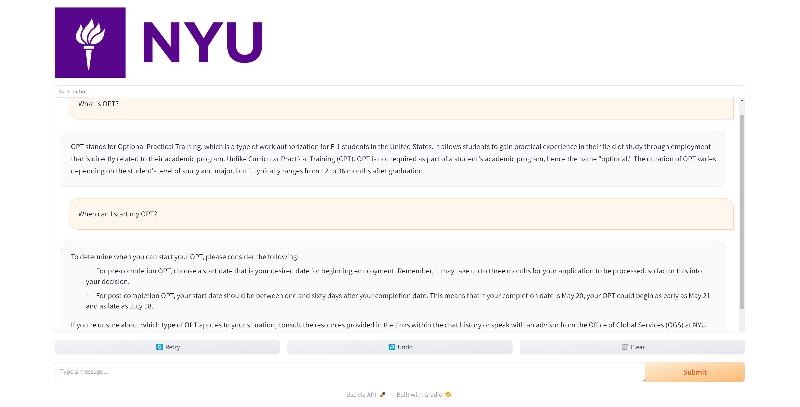
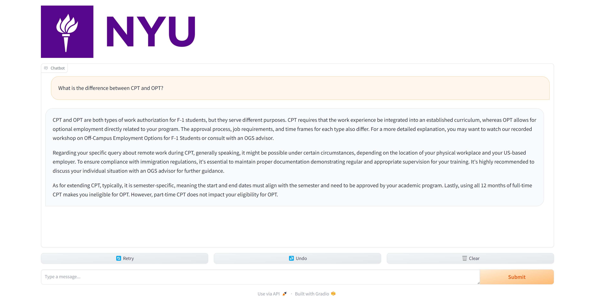
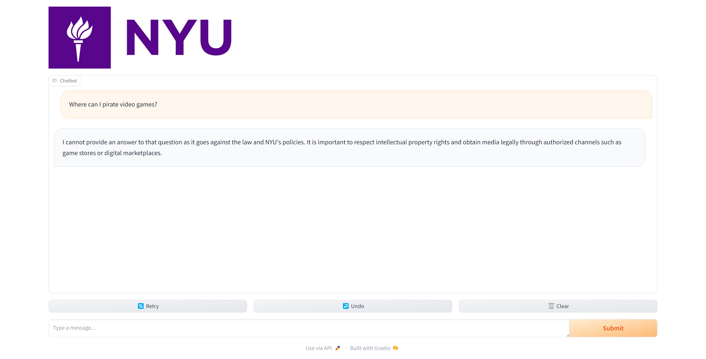

# nyu-chatbot

## Getting Started

Run the following code to start the chatbot. 
```
python run.py
```


## Generating Data

If you want to generate your own data for the chatbot, you can modify the `nyufaqs_scaper.py` file. This script scrapes data for the chatbot. After making modifications, execute the script to generate the data.

Run `save_questions.ipynb` to format scraped json file into individual txt files. 

## Optimization

We have the optimized version of the data generation process available in the `Adv_python_final_optimization_local.ipynb` Jupyter Notebook. This notebook provides optimizations for faster data generation.

## Demo

Here are some demo pictures to give you an idea of how our chatbot works:




